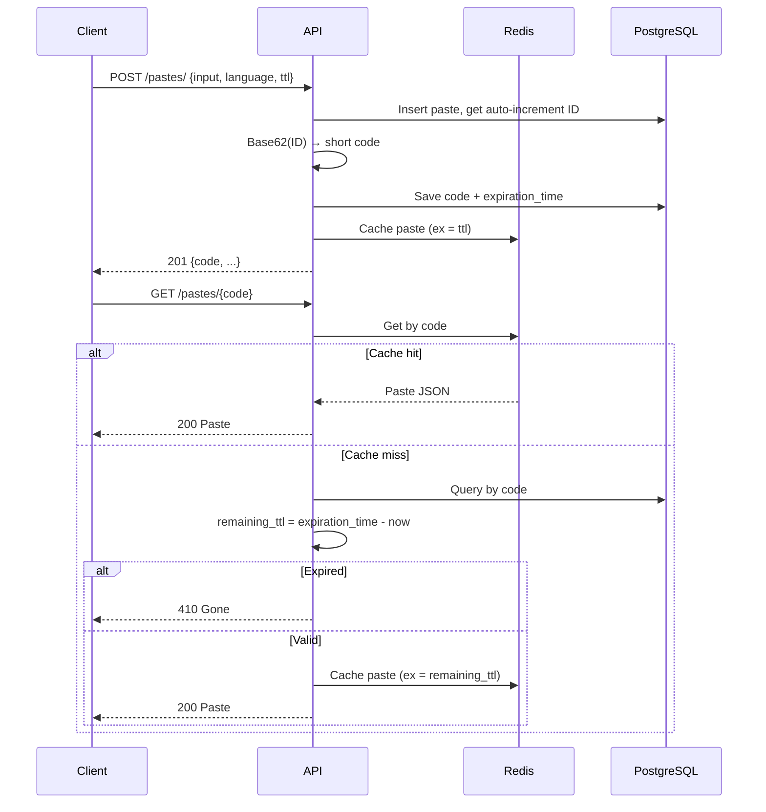

# Architecture

A REST API that lets users store and retrieve text snippets (pastes) with a TTL. Each paste gets a short code; expired pastes return 410 Gone.

## Stack

- **FastAPI** — HTTP API
- **PostgreSQL** — persistent storage
- **Redis** — TTL-aware cache
- **SQLModel** — ORM + schema validation

## Flow

## Short Code Generation

The DB auto-increment ID is Base62-encoded to produce a short, URL-safe code (e.g. ID `1000` → `"g8"`). This guarantees uniqueness without a separate lookup.

## Key Design Decisions

- **Remaining TTL on cache miss** — Redis is set with `expiration_time - now`, not the original `ttl`, so cache never outlives the paste.
- **Write-through on create** — cache is primed immediately after POST to avoid a cold-read on the first GET.
- **410 before caching** — expired pastes are never written to Redis.
